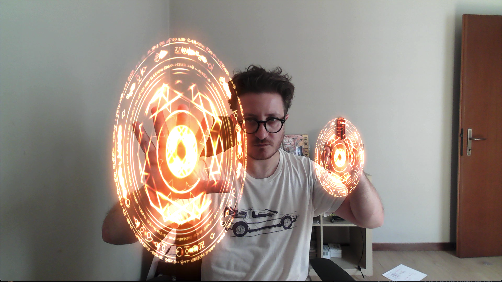
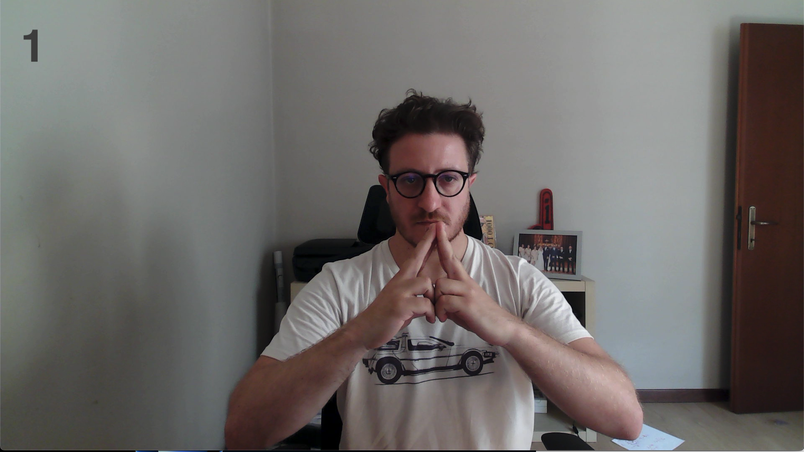
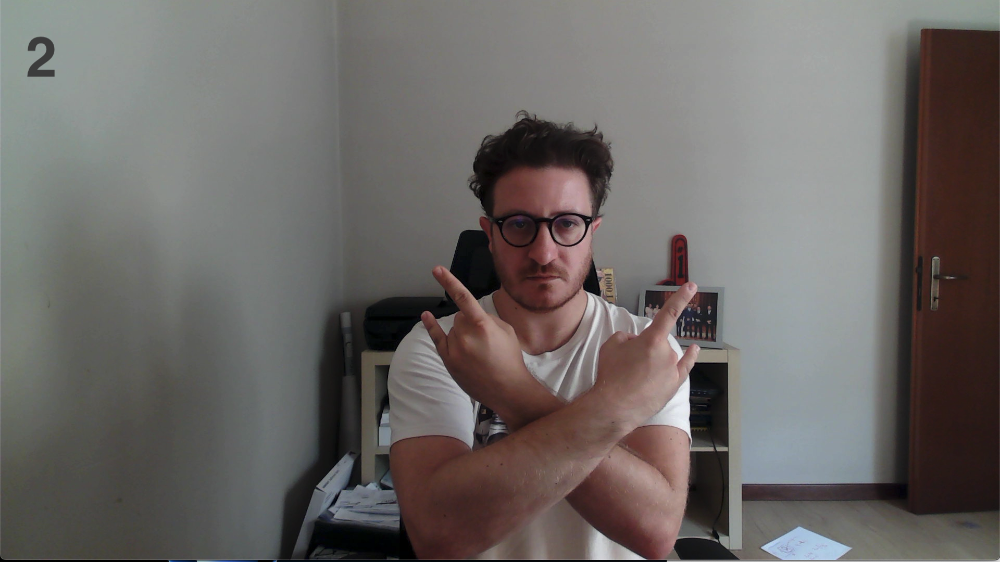

🛡️ Dr. Strange Shields – Gesture Magic in Action

Cast mystical shields in real-time! Detect hand gestures and unleash magical effects using Python, OpenCV, and MediaPipe.

  

✨ Key Features

Real-Time Tracking: Smooth hand detection with MediaPipe

Smart Recognition: SVM classifies gestures accurately

Magic Sequences: Shields activate only in correct order

Dynamic Effects: Shield overlays scale with hand position

Flexible Output: OpenCV window, virtual camera, or both

🚀 Quick Start
# Install dependencies
pip install -r requirements.txt

# Run default
python shield.py

Options:

--camera_id → Select camera

--output → window, virtual, both

--shield → Custom shield animation

--threshold → Gesture confidence

🧠 How It Works

Hand Detection: 21 landmarks per hand

Gesture Recognition: SVM predicts hand gestures

Sequential Activation: Shields only appear in correct sequence

Visual Magic: Animated shields overlay on hands

🎯 Gesture Flow

Activation: KEY_1 → KEY_2 → KEY_3 → Shields ON
Deactivation: KEY_4 → Shields OFF

    
 
  

🐛 Tips & Tricks

Keep both hands visible and well-lit

Adjust threshold if gestures are misread

Lower resolution for smoother performance

Made with Python 🐍, hand gestures 🤲, and a touch of CodeXpert magic ✨
